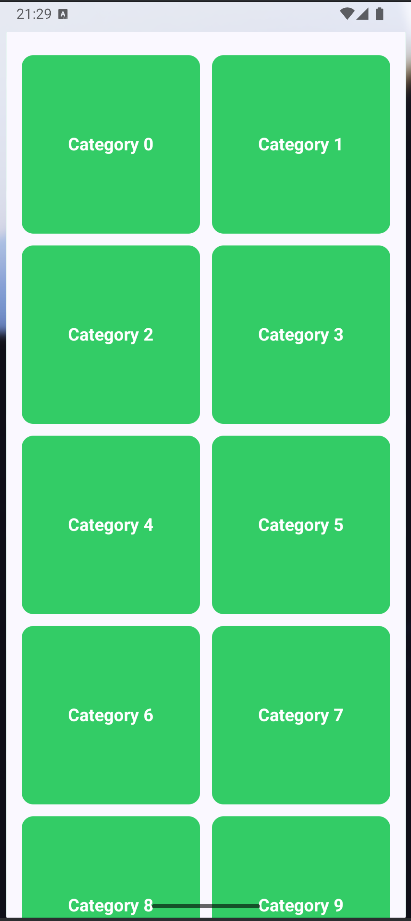
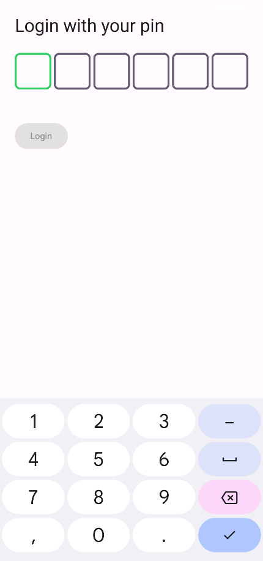

# 🚀 Jetpack Compose Learning Journey  

> **Lưu trữ quá trình học và ứng dụng Jetpack Compose từ cơ bản đến nâng cao.**  

---

## 📱 Screenshots  

### 🔐 Login Screen  
  

---

### 📏 Constraint Layout  
  

---

### 🔲 Lazy Grid  
  

---

### 🔄 OTP Side Effect  
  

---

## 📌 Nội dung  

✅ **Constraint Layout** – Sử dụng `ConstraintLayout` để tạo UI linh hoạt.  
✅ **Lazy Grid** – Hiển thị danh sách dữ liệu bằng `LazyVerticalGrid`.  
✅ **OTP Side Effect** – Xử lý hiệu ứng nhập mã OTP một cách tối ưu.  

📖 **Mục tiêu:**  
- Áp dụng Jetpack Compose để xây dựng UI hiện đại.  
- Hiểu cách tổ chức bố cục, danh sách động, và quản lý trạng thái.  
- Tích lũy kinh nghiệm thực tế thông qua các bài tập và dự án nhỏ.  

---

## 🔧 Công nghệ sử dụng  

- 🛠 **Jetpack Compose** – UI Toolkit mới của Android.  
- 🏗 **Material Design 3** – Thiết kế UI theo chuẩn mới nhất.  
- 🔄 **State Management** – Quản lý trạng thái hiệu quả.  

--- 

🚀 **Happy Coding!** 💙  
